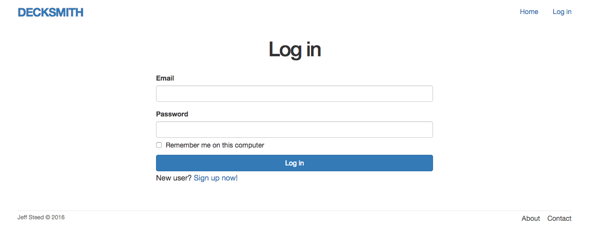
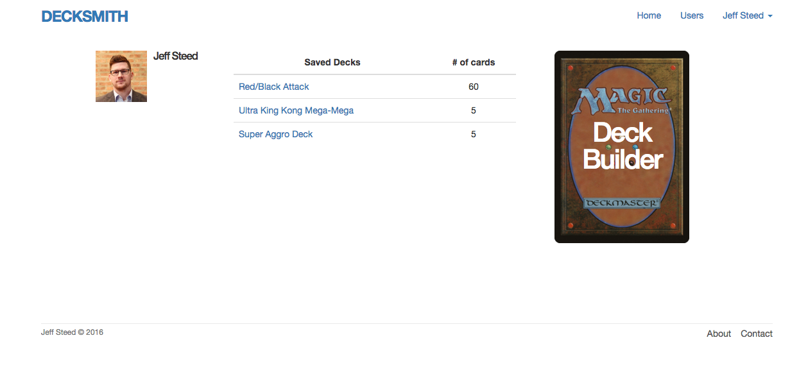
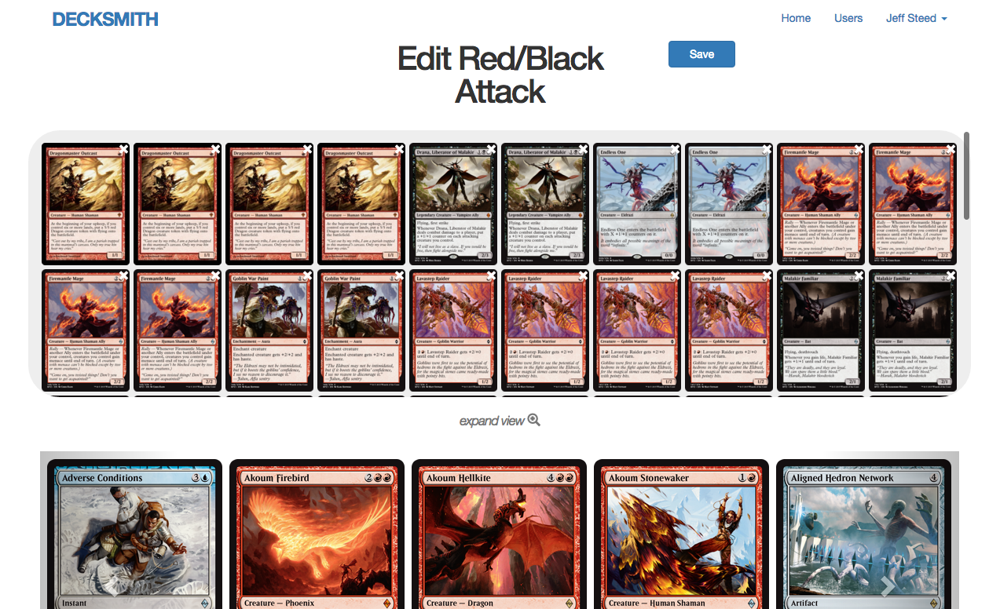

# Decksmith
### Decksmith is a Magic: The Gathering&copy; deck building app.

##### You'll be able to...
--------------------------
- View card sets
- Build one or more decks
- Save one or more decks
- Edit and delete decks

#### User Registration and Login
1. User Registration
2. User login
3. Persistent sessions using cookies
4. Friendly forwarding
5. Secure Sockets Layer (SSL)

#### User Profile Pages
1. User avatars
2. Deck list with all your saved decks
3. Build a new deck

#### Build Decks!
1. Card set carousel
2. Drag and Drop functionality
3. Drag cards into the "drop zone" space
4. Edit existing decks or create a new one

This project was built primarily with Ruby on Rails.
Technologies used:
- Ruby/ Ruby on Rails
- PostgreSQL
- Bootstrap
- HTML/CSS/SASS
- JavaScript
- JQuery

The approach I took on this project was to start with a User model, after wireframing of course, to allow user registration and authentication functionality. With this, I was able to ensure users that their profiles and saved decks would be secure.

After successfully developing the User model, I then focused on the meat and potatoes of the app, and that is the cards/decks. I created a Deck model that I could use to store the decks that users create. This would allow them to create new decks, edit them, and save them.

After developing the User and Deck model, I turned my attention to the client side and providing an interactive and dynamic experience for the user using JavaScript, Bootstrap, and JQuery. This provided an interactive interface that allows the user to drag and drop cards for deck creation and editing.

The major hurdle I faced on this project was finding an adequate API to utilize for the card images and descriptions. There were several AJAX calls used to pull in a significant amount of cards per page.

Give more time, I would use ReactJS to implement an "advanced search" criteria component.
